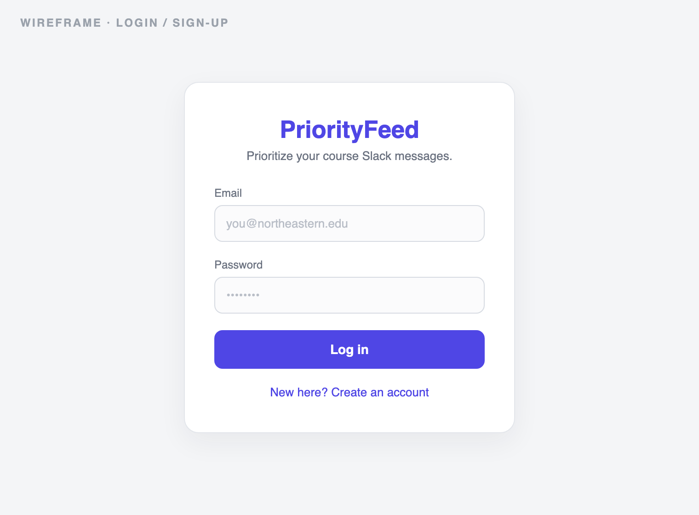
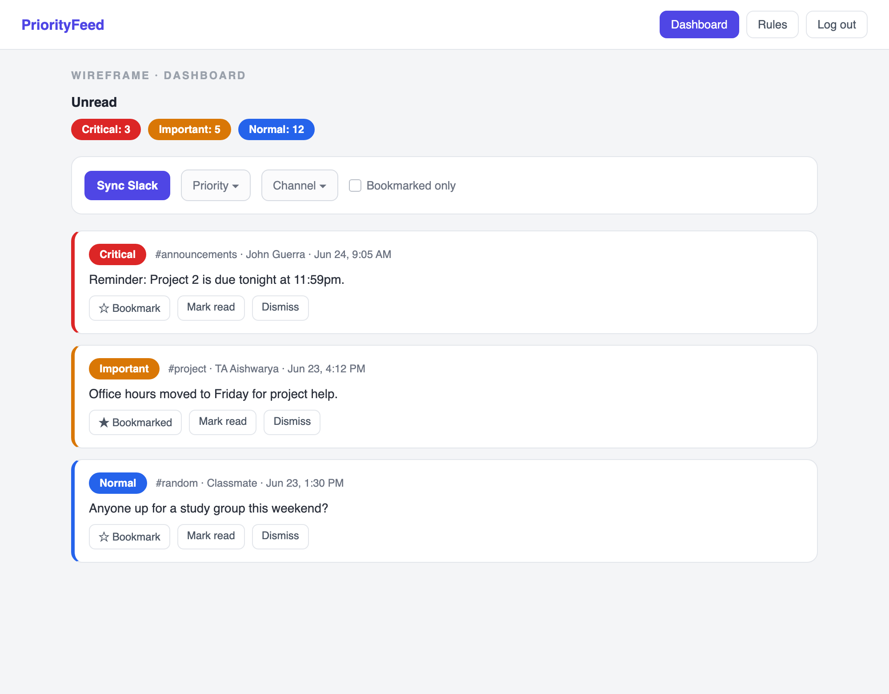
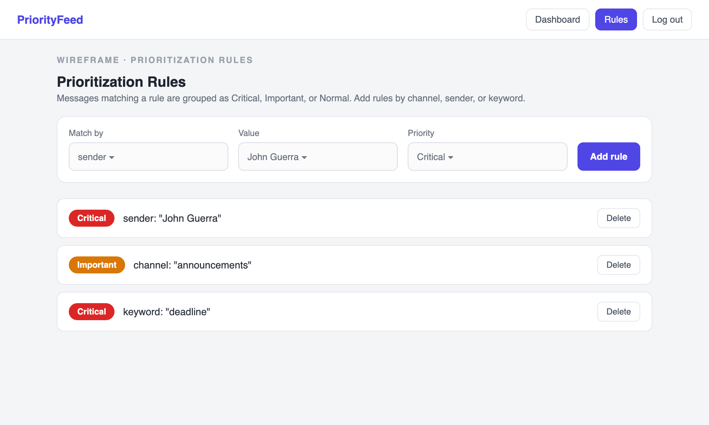

# PriorityFeed — Design Document

**Academic Communication Prioritizer**
Author: Harini Thirunavukkarasan
Course: Web Development (Online) — Northeastern University

---

## 1. Project Description

In massive online courses, students receive hundreds of Slack messages a week
across many channels. Important announcements from instructors, TAs, and course
staff get buried in general discussion, so students miss assignment updates and
deadlines.

**PriorityFeed** is a full-stack web application that integrates with Slack and
helps students prioritize academic communication. Instead of showing messages in
chronological order, it lets each student define their own prioritization rules
(by channel, sender, or keyword). Incoming Slack messages are collected, stored,
and sorted into **Critical / Important / Normal** tiers, so the most relevant
information surfaces first. The result is less information overload and fewer
missed announcements.

---

## 2. User Persona

### Harini — Graduate Student

Harini is enrolled in multiple technical courses that use Slack as the primary
communication platform. Large class channels generate hundreds of messages every
week, making it easy to miss assignment updates, project announcements, and
instructor responses. She wants a personalized dashboard that surfaces the
messages most relevant to her while filtering out noise from high-volume
discussions.

**Goals**

- Never miss an instructor/TA announcement.
- See what's important at a glance instead of scrolling every channel.
- Catch up quickly after being away.

**Frustrations**

- Important messages buried under casual chatter.
- Slack's chronological feed treats every message equally.
- Too many notifications to be useful.

---

## 3. User Stories

### Slack Integration & Message Collection

- As a student, I want to connect my Slack workspace so course messages appear in
  my dashboard automatically.
- As a student, I want newly received messages collected and stored so I can
  review them even if I missed them in Slack.
- As a student, I want messages from multiple channels organized in one dashboard
  so I can manage academic communication efficiently.

### Message Prioritization & Organization

- As a student, I want to create prioritization rules based on instructors, TAs,
  channels, or keywords so important messages stand out.
- As a student, I want messages grouped into Critical, Important, and Normal so I
  can quickly tell what needs attention.
- As a student, I want to filter messages by priority, sender, or channel so I can
  focus on what matters.
- As a student, I want to bookmark important messages so I can return to them.

### Notification Management

- As a student, I want to see a summary of unread high-priority messages so I can
  quickly catch up after being away.

---

## 4. Design Mockups / Wireframes

### 4.1 Login / Sign-up

A single card handles both login and sign-up. The user enters an email and
password; a link toggles between the two modes.



### 4.2 Dashboard

The main screen. An **Unread** summary shows counts per priority. A toolbar offers
**Sync Slack** plus filters (priority, channel, bookmarked). Each message is a
card with a priority badge, channel/sender/time, the message text, and actions
(Bookmark, Mark read, Dismiss). The colored left border encodes priority —
red = Critical, amber = Important, blue = Normal.



### 4.3 Rules

Where prioritization is configured. A form adds a rule by **channel**, **sender**,
or **keyword** mapped to a priority. When matching by sender or channel, the Value
field auto-suggests real names/channels from already-synced messages. Existing
rules are listed below with a delete action.



---

## 5. Technical Design

### Data Model (MongoDB — 3 collections)

**users** — account + authentication

```
{ _id, email, passwordHash, createdAt }
```

**messages** — Slack messages with categorization + status

```
{ _id, userId, channelId, channelName, senderId, senderName,
  text, ts, tsDate, priority, bookmarked, read, fetchedAt }
```

**rules** — user-defined prioritization rules

```
{ _id, userId, type ('channel'|'sender'|'keyword'),
  value, priority ('Critical'|'Important'|'Normal'), createdAt }
```

### Technical Independence

- **users** independently manages authentication and account state.
- **messages** independently manages ingestion, storage, categorization,
  filtering, and status (read / bookmarked).
- **rules** independently manages the prioritization logic.

### Prioritization Logic

On sync (and whenever rules change), every message is evaluated against the
user's rules. The highest-priority matching rule wins; if none match, the message
defaults to **Normal**. Rules match by exact channel name, sender name/ID
(substring or Slack ID), or keyword contained in the message text.

### Architecture

```
Browser (vanilla JS SPA, client-side rendering)
        │  fetch / JSON
        ▼
Express API  ──►  Slack Web API (conversations.history)
        │
        ▼
MongoDB (native driver) — users · messages · rules
```

### Technology Stack

- **Frontend:** Vanilla JavaScript (ES6 modules), HTML, CSS
- **Backend:** Node.js + Express (ESM)
- **Database:** MongoDB (native Node.js driver)
- **External Integration:** Slack Web API
- **Data Requests:** Fetch API
